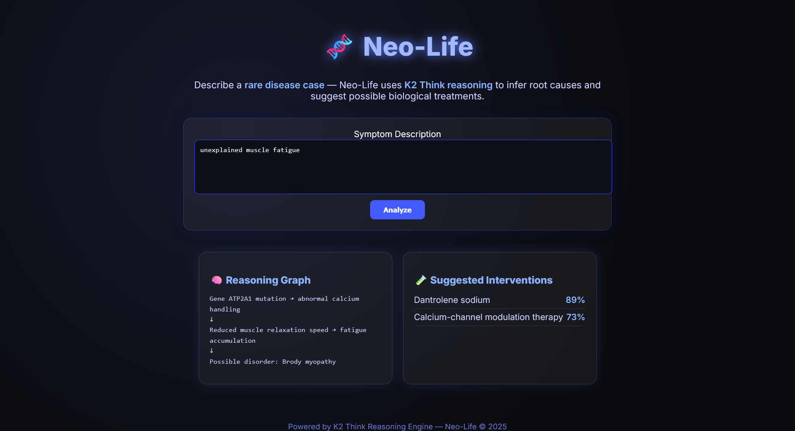

# 🧬 Neo-Life: Explainable AI for Rare Disease Reasoning



---

### 🚀 Project Overview
**Neo-Life** is an AI-powered reasoning system that analyzes rare disease cases based on symptoms.  
Using **K2 Think’s biological reasoning network**, it identifies the **most probable genetic root cause** and suggests **logical treatment candidates** — all with an **explainable reasoning chain**.

---

### 🎯 Problem Statement
Rare diseases often lack large-scale clinical data, making diagnosis and treatment **slow, expensive, and uncertain**.  
Neo-Life aims to bridge this gap by using **AI reasoning graphs** that mimic how researchers think — connecting  
**genes → enzymes → effects → diseases** to infer root causes.

---

### 💡 How It Works
1. **Input:** User enters a symptom description (e.g., *“unexplained muscle fatigue”*).  
2. **Reasoning:**  
   - K2 Think AI maps biological relationships.  
   - Builds a **transparent reasoning chain** for interpretability.  
3. **Output:** Suggests **biological interventions** with confidence levels.

---

### 🧩 Demo Visualization

| Feature | Description |
|----------|-------------|
| 🧠 **Reasoning Graph** | Shows the AI’s reasoning steps |
| 🧪 **Suggested Interventions** | Displays treatment candidates with confidence |
| 🌌 **Visual Theme** | Futuristic dark UI with glowing highlights |
| ⚙️ **Implementation** | Pure HTML, CSS, and JavaScript (no frameworks) |

---

### 🧠 Example Output
**Input:**  
`unexplained muscle fatigue`

**Output:**
Gene ATP2A1 mutation → abnormal calcium handling
↓
Reduced muscle relaxation speed → fatigue accumulation
↓
Possible disorder: Brody myopathy

Suggested Interventions:
• Dantrolene sodium (89%)
• Calcium-channel modulation therapy (73%)

---

### 🛠️ Tech Stack

| Technology | Purpose |
|-------------|----------|
| **HTML5** | Structure |
| **CSS3 (Custom + Gradients)** | Styling |
| **JavaScript (Vanilla)** | Interactivity |
| **GitHub Pages / Vercel** | Hosting |

---

### 💻 Run Locally
```bash
# Clone this repository
git clone https://github.com/<your-username>/neo-life-demo.git

# Open the folder
cd neo-life-demo

# Launch in browser
start index.html   # (or double-click index.html)
